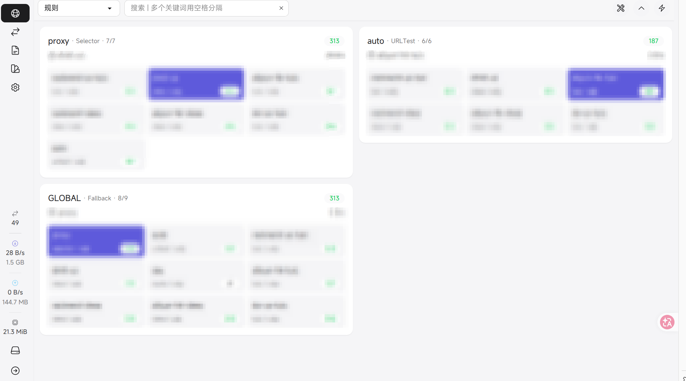

# useful_scripts
Some useful scripts for linux operation and maintenance.

## 环境配置
```
pip install -r requirements.txt
```

## sing-box 普通用户安装 (无 sudo)

该脚本允许普通用户在无 sudo 权限的情况下配置 sing-box 代理。

### 功能
1. 自动下载最新版 sing-box 并安装到 `~/bin`。
2. 自动下载 `geosite.dat` 和 `geoip.dat` 规则文件。
3. 根据提供的输入源生成最终配置文件 `config.json`（支持 URI 订阅、Mihomo/Clash YAML、sing-box JSON，或 `@xxx.json` 模式）。
4. 配置 systemd user service 实现开机自启和自动重启。
5. 自动配置用户级文件日志轮转（`~/service/sing-box/*.log`）。
6. 自动将 `src/sing-box/vpn.sh` 写入用户默认 shell 启动文件（zsh: `~/.zshrc`，bash: `~/.bashrc`，其他回退 `~/.profile`）。
7. 安装 `sb` 命令行工具，提供服务管理、版本查询、代理切换、面板访问等功能。

### 使用方法

1. 准备输入源（二选一）：
	- 订阅文件或订阅 URL（例如 `subscribe.txt`、`glados.yaml` 或 `https://example.com/sub`）：
		- URI 行订阅（每行一个链接，支持 `vless://`、`vmess://`、`trojan://`、`ss://`、`hysteria2://`、`tuic://`）
		- Mihomo/Clash YAML（含 `proxies` / `proxy-groups`）
		- sing-box JSON（完整配置或 `outbounds` 列表）
	- JSON 文件（例如 `sub.json`），在安装脚本提示时输入 `@sub.json`。
2. 运行安装脚本：

```bash
bash src/sing-box/install.sh
```

3. 脚本会提示输入路径或 URL：
	- 输入普通路径时按订阅链接文件处理。
	- 输入 `https://...` 时自动下载远程订阅内容。
	- 输入 `@xxx.json` 时按 JSON 模式处理。
4. 安装前会先执行导入预检查（不落盘）：若订阅不可解析，会直接中止并提示错误。
5. 安装完成后，服务会自动启动。
6. 安装完成后会自动在默认 shell 启动文件追加 `source "<repo>/src/sing-box/vpn.sh"`（幂等，不重复写入）。

vpn 代理快捷函数（由 `vpn.sh` 提供）：
- `set_proxy`：按当前 `config.json` 的 mixed 端口启用环境变量代理
- `unset_proxy`：清理代理环境变量
- `show_proxy`：查看当前代理环境变量状态

如果安装时检测到当前用户已经存在 sing-box 用户级服务或 sing-box 进程，安装脚本会先停止/终止它们，再继续重装。

JSON 模式会解析并应用 JSON 中的 `outbounds` 等核心字段到最终配置。

### sb 命令菜单

安装脚本会自动安装 `sb` 命令到 `~/bin/sb`。

- `sb`：唤起交互菜单
- `sb s`：查看当前用户级 sing-box 服务状态
- `sb v`：查看当前 sing-box 内核版本
- `sb r`：重启当前用户级 sing-box 服务
- `sb upgrade`：更新 sing-box 内核（自动使用当前代理端口，更新后自动重启并打印新版本）
- `sb self-update`：一键更新 `sb` 脚本到仓库最新版本（自动备份旧版）
- `sb d`：打印当前 sing-box 工作目录
- `sb ip`：输出当前默认代理出口 IP（含地区信息）
- `sb speedtest`：测试当前默认代理速度
- `sb proxy`：打印当前可用代理并交互切换默认代理（**存在切换后`sb ip`未发生变化的bug，更推荐使用面板切换代理**）
- `sb panel`：在 SSH 会话中输出当前机器的面板地址，并自动给出本机端口转发命令
- `sb panel user@host`：在本机建立到远端 `user@host` 的 SSH 本地转发并打开面板
- `sb tunnel user@host`：`sb panel user@host` 的别名

面板示意图：


面板访问补充：
- `sb panel --set-default user@host`：保存默认远端主机，下次可直接运行 `sb panel`
- `sb panel --local-port 19090 user@host`：指定本地转发端口
- `sb panel --print-only user@host`：仅打印本地面板地址，不自动打开浏览器
- 如远端 `clash_api.secret` 非空，面板端需要配置对应 secret

当你在 SSH 登录的远端机器上执行 `sb panel`，会看到类似以下提示：

```text
Panel URL: http://127.0.0.1:9092/ui
Please run the following command on your local machine:
ssh -N -L 9092:127.0.0.1:9092 user@server
```

此时请在你自己的本机终端执行上面的 `ssh -L` 命令，再在本机浏览器访问 `http://127.0.0.1:9092/ui`。

如果本机 `9092` 端口已占用，可以改为其他本地端口：

```bash
ssh -N -L 19092:127.0.0.1:9092 user@server
```

然后访问 `http://127.0.0.1:19092/ui`。

代理切换补充：
- `sb proxy list`：仅打印当前可用代理和当前默认代理
- `sb proxy <序号>`：按序号切换默认代理
- `sb proxy <tag>`：按节点标签切换默认代理

`sb speedtest` 会优先调用本机已有的 `speedtest-cli`。
如果未找到 `speedtest-cli`，会根据系统架构自动下载官方 Ookla CLI 包：
`https://install.speedtest.net/app/cli/ookla-speedtest-1.2.0-linux-$ARCH.tgz`

支持架构：`i386`、`x86_64`、`armel`、`armhf`、`aarch64`。
下载后会在 `~/bin` 安装 `speedtest`，并生成兼容入口 `speedtest-cli`。

### 管理命令[deprecated]

推荐使用sb命令替代以下 systemctl 命令：

- 启动服务: `systemctl --user start sing-box`
- 停止服务: `systemctl --user stop sing-box`
- 重启服务: `systemctl --user restart sing-box`
- 查看状态: `systemctl --user status sing-box`
- 查看日志: `journalctl --user -u sing-box -f`

### 日志轮转规则（用户级）

安装脚本会自动部署 `sing-box-log-rotate` 和 `sing-box-log-rotate.timer`（systemd --user）：

- 检查频率：每小时一次（`OnCalendar=hourly`）
- 轮转范围：`~/service/sing-box/` 下所有 `*.log`
- 触发条件：单个日志文件超过 20MB
- 轮转方式：`copytruncate`（复制后截断原文件，避免服务重启）
- 历史保留：压缩归档（`.gz`）保留 14 天，超过自动删除

可选环境变量（用于自定义策略）：
- `SINGBOX_LOG_MAX_SIZE_MB`（默认 20）
- `SINGBOX_LOG_RETENTION_DAYS`（默认 14）

### 注意事项
- 确保 `~/bin` 在你的 PATH 环境变量中（脚本会自动尝试添加）。
- 代理脚本会自动从当前 `~/service/sing-box/config.json` 中读取 mixed 代理端口；如果配置文件不存在，则回退到 7897。

## 已部署用户增量升级指南（无需重装）

### 1. 仅更新 sb 脚本

如果当前 `sb` 版本已包含 `self-update`：

```bash
sb self-update
hash -r
```

如果当前 `sb` 版本还没有 `self-update`，可先手动更新一次：

```bash
install -m 755 src/sing-box/sb.sh "$HOME/bin/sb"
hash -r
```


### 1.1 已部署用户补充 vpn.sh 自动加载

如果是旧版本部署（安装时还未自动写入 `source vpn.sh`），可执行以下任一方式：

方式 A（推荐）：重新运行安装脚本，自动补齐 shell 启动文件写入逻辑。

```bash
bash src/sing-box/install.sh
```

方式 B：手动写入默认 shell 启动文件（请将路径替换为你的仓库绝对路径）：

```bash
echo 'source "/ABS/PATH/useful_scripts/src/sing-box/vpn.sh"' >> ~/.zshrc
# 或 ~/.bashrc
source ~/.zshrc
```

### 2. 已部署用户更新订阅

推荐使用 `update_subscription.sh`，支持本地文件、URL、append/replace/check：

```bash
# 追加模式（默认）
bash src/sing-box/update_subscription.sh -u "https://example.com/sub"

# 替换模式（从模板重建）
bash src/sing-box/update_subscription.sh -u "https://example.com/sub" -r

# 仅校验不应用
bash src/sing-box/update_subscription.sh -u "https://example.com/sub" -c

# 更新后不重启服务
bash src/sing-box/update_subscription.sh -u "https://example.com/sub" -n
```

说明：
- 脚本会自动备份旧配置为 `~/service/sing-box/config.json.bak.<timestamp>`。
- 订阅内容支持 URI 行、Mihomo/Clash YAML、sing-box JSON。

### 3. 已部署用户补充日志轮转

如果你的环境是旧版本部署（尚未启用用户级日志轮转），可手动执行：

```bash
bash src/sing-box/setup_user_logrotate.sh
```

检查状态：

```bash
systemctl --user status sing-box-log-rotate.timer
systemctl --user list-timers | grep sing-box-log-rotate
```

手动触发一次轮转：

```bash
systemctl --user start sing-box-log-rotate.service
```

### 4. 常见排查

- `sb` 命令找不到：执行 `echo $PATH` 确认包含 `~/bin`，或重新登录 shell。
- 面板打不开：确认是本机访问还是远端访问场景，SSH 场景必须先做本地端口转发。
- 订阅导入失败：优先使用 `update_subscription.sh -c` 检查模式观察错误信息。

## traffic_report.py

快速部署说明：

1. 确保安装并初始化 vnstat (v2), requests, python-dotenv。
2. 配置 `.env`（或在系统环境变量中设置）以下字段：
	- MONTHLY_LIMIT_GB - 每月流量限额（默认 100）
	- MONTHLY_LIMIT_MODE - 'tx'（默认，仅计 tx）或 'total'（计 rx + tx）
	- MACHINE_NAME - 机器名（可选，如果不提供脚本会用 hostname）
	- INTERFACE - 指定网卡（可选，脚本会自动检测）
	- FEISHU_WEBHOOK_URL, FEISHU_SECRET - 飞书机器人（可选）
	- TELEGRAM_BOT_TOKEN, TELEGRAM_CHAT_ID - Telegram 通知（可选）
	- SMTP_SERVER, SMTP_PORT, SMTP_USER, SMTP_PASSWORD, SMTP_FROM, SMTP_TO - SMTP 邮件通知（可选）

示例 .env:
```
MONTHLY_LIMIT_GB=200
MONTHLY_LIMIT_MODE=total
MACHINE_NAME=my-prod-server
INTERFACE=
FEISHU_WEBHOOK_URL=https://open.feishu.cn/open-apis/bot/v2/hook/xxx
FEISHU_SECRET=xxx
``` 

运行:
```
python3 src/traffic_report/traffic_report.py
```

CLI 选项（支持 `--help`）:
    - `--env-file`：指定 dotenv 文件的路径，在运行前加载


安装 cron 示例:
```
sudo useful_scripts/deploy/install_cron.sh
```

卸载示例:
```
sudo useful_scripts/deploy/uninstall_cron.sh [user]
```